# AgentScope

AgentScope 是一个面向真实项目的 AI 方案评估与执行规划平台：输入项目描述，选择 Quick / Expert 模式和已连接的 Provider / 模型，系统会生成项目画像，检索本地 AI 生态知识库，补充 GitHub 与官方来源，过滤不适配项，并输出可执行的 Agent 工作流、成本估算和项目专属 Prompt。

它解决的是“这个项目应该用什么模型、Agent、Skill、MCP 和开源项目”的落地问题，而不是只生成一段泛泛的 AI 建议。报告会把已核验来源、知识库快照、实时搜索结果、推测建议和人工确认节点分开显示。

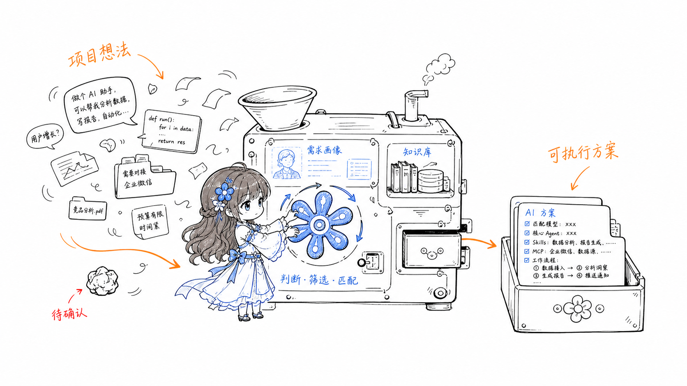

上图展示 AgentScope 的核心工作方式：把项目想法、访谈信息和已有知识交给需求画像与知识库，再经过来源核验、规则筛选和能力匹配，生成项目专属的模型、Agent、Skill、MCP、Workflow、报告与 Prompt。图中的内容用于解释产品流程，不代表固定的模型或工具组合。

## 产品预览

下面的截图来自 AgentScope 的实际界面，按“输入项目 → 配置能力 → 分析 → 生成执行方案”的使用路径展示。截图中的项目内容是演示数据，Provider、模型、成本与外部来源以用户实际配置和最新核验结果为准。

### 1. 项目输入与模型选择

用户先描述目标，再选择 Quick / Expert 模式和本次评估使用的 Provider / 模型。模型选择会绑定到当前项目，不会在分析过程中静默切换。

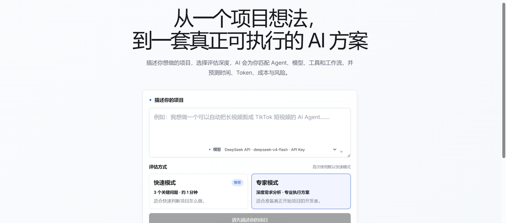

### 2. AI Provider 与研究能力配置

AI 配置页支持 Codex CLI、Claude CLI、Gemini CLI、DeepSeek 和自定义 OpenAI-compatible Provider；研究能力页可配置浏览器搜索、GitHub、浏览器自动化、MCP、文件访问和终端执行。

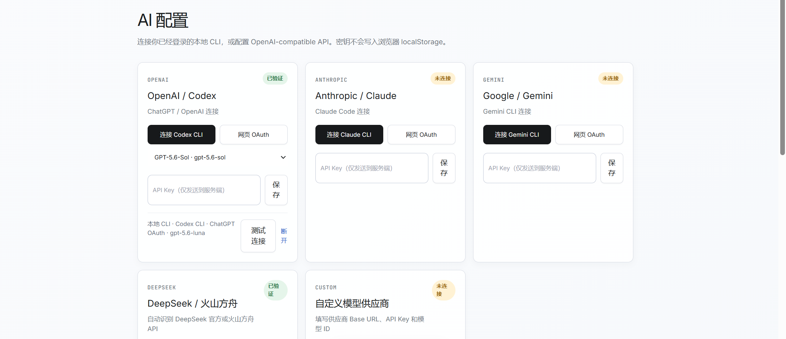

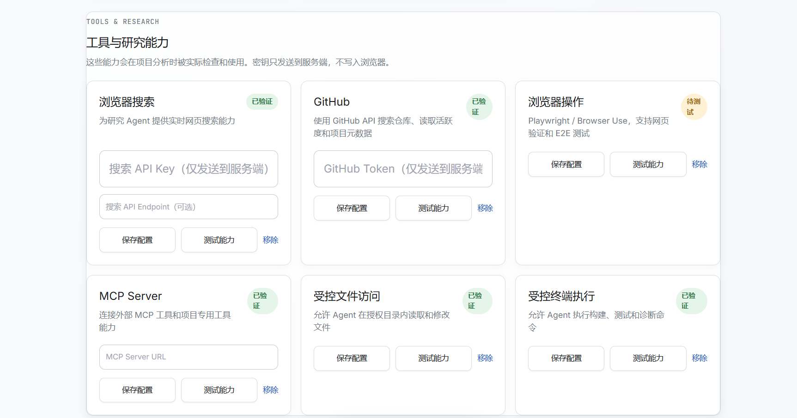

### 3. 知识库与本机能力

知识库用于沉淀模型、Agent、Skill、MCP、Plugin、工具和参考项目。用户可以同步公开来源、扫描本机 Skill / MCP，或导入自己的 JSON；敏感凭据不会被扫描或写入知识库。

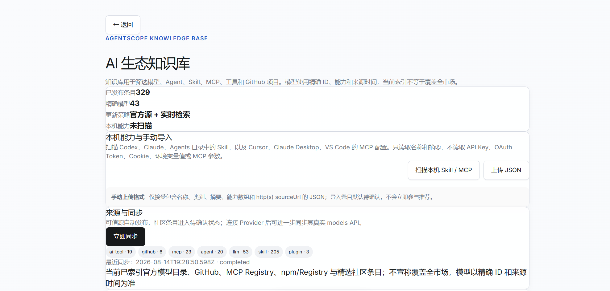

### 4. 历史记录

历史页面保留过去的项目描述、访谈进度、Provider / 模型、分析状态和报告入口。旧报告会标记生成状态，输入或知识库变化后需要重新分析。

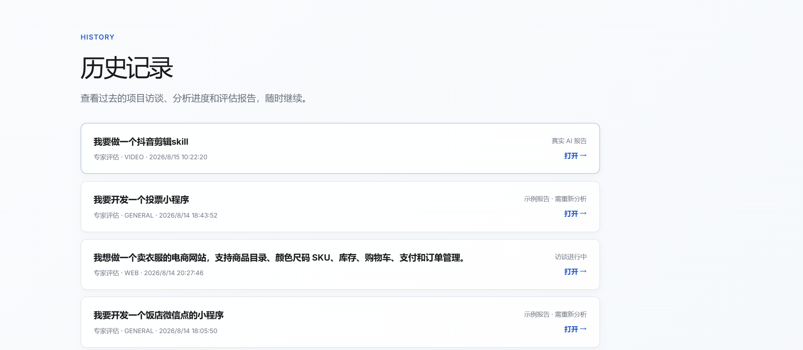

### 5. 项目结论与实施策略

报告首先给出项目专属结论、可行性评分和推荐策略，再展示时间、实施 Token、AI / API 成本与人工投入。这里的 Token 是项目实施预测，不是本次评估调用消耗。

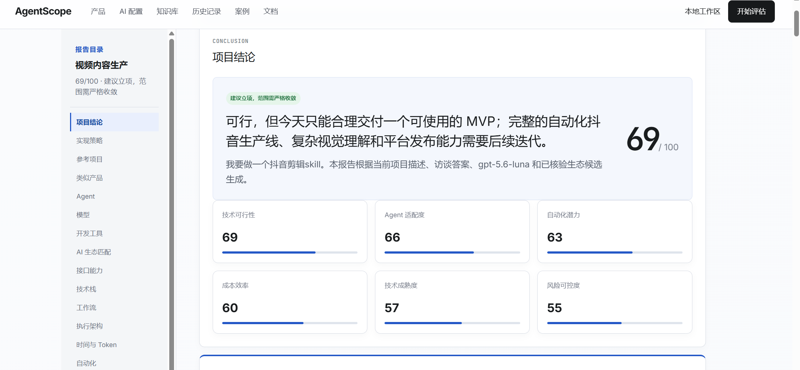

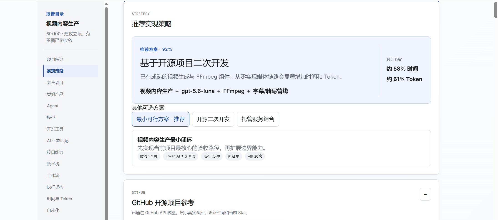

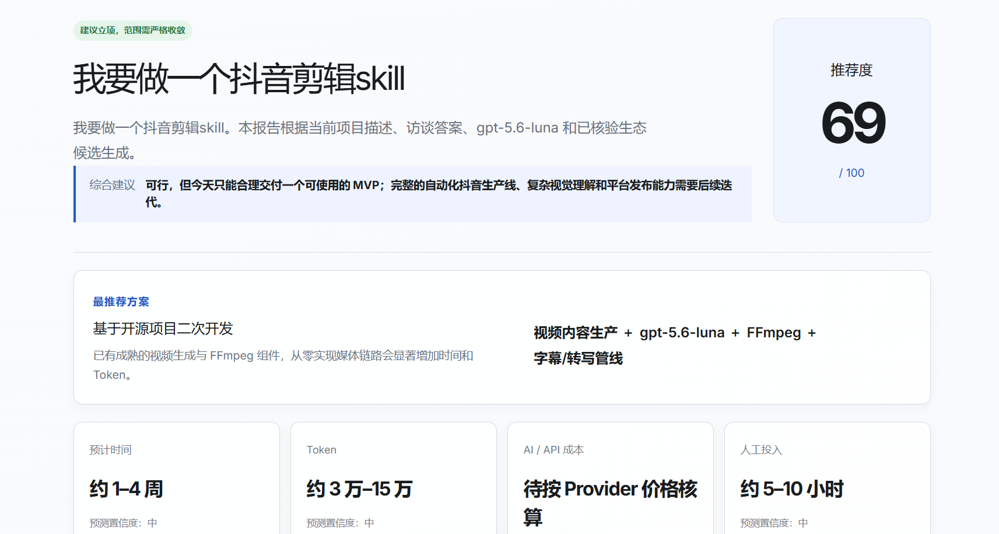

### 6. GitHub 项目与类似产品

系统优先查询本地知识库，再补充 GitHub 和官方来源，并对仓库链接、更新时间、Star、License 等信息进行核验。类似产品用于理解用户流程和边界，不等于建议直接复制产品或代码。

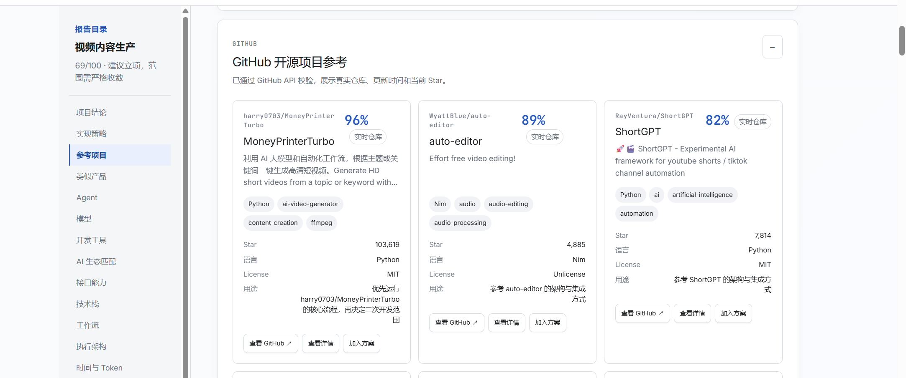

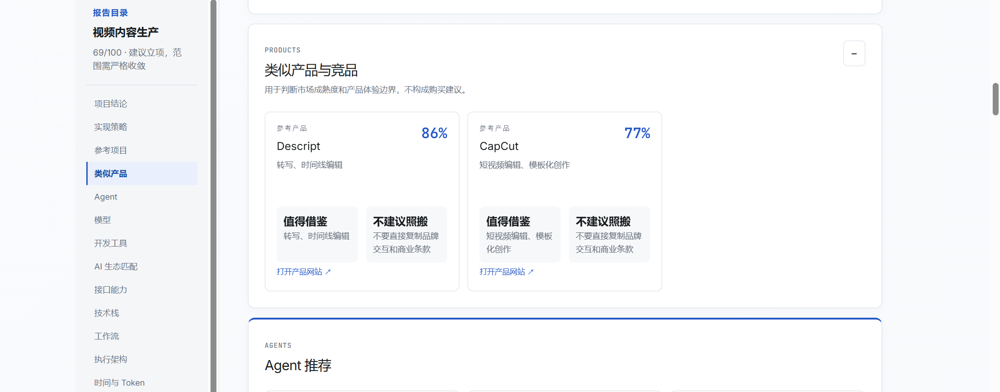

### 7. Agent、模型与开发工具

推荐结果会按当前项目生成 Agent 队列、模型角色路由和工具链，并解释每项能力为什么匹配、哪些条件仍需人工确认。不同项目会得到不同的 Agent 顺序和模型组合。

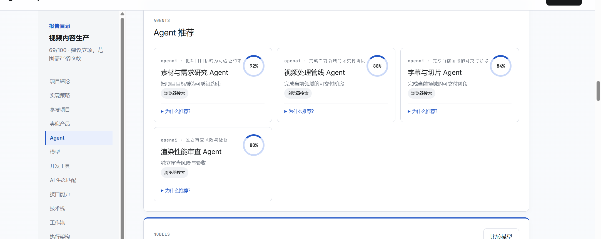

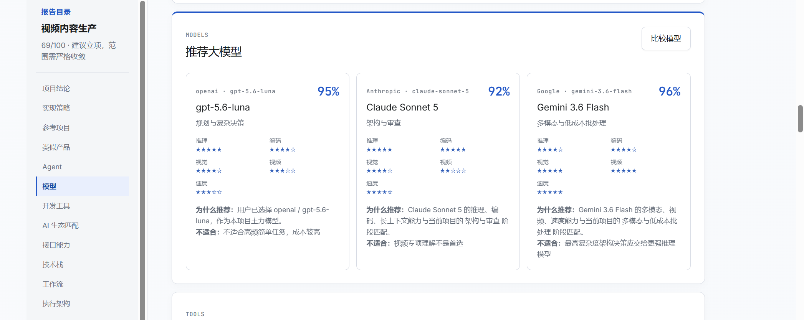

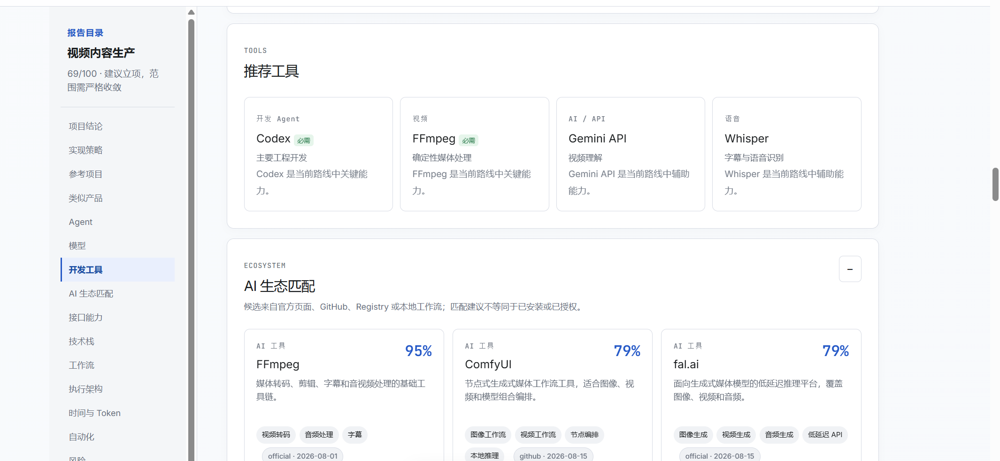

### 8. 能力矩阵、Workflow、估算与风险

报告会把 API、CLI、MCP、SDK、浏览器和 Computer Use 能力放入矩阵，进一步展开 Agent Workflow、架构节点、自动化率、时间 / Token / 成本估算，以及风险和人工确认点。

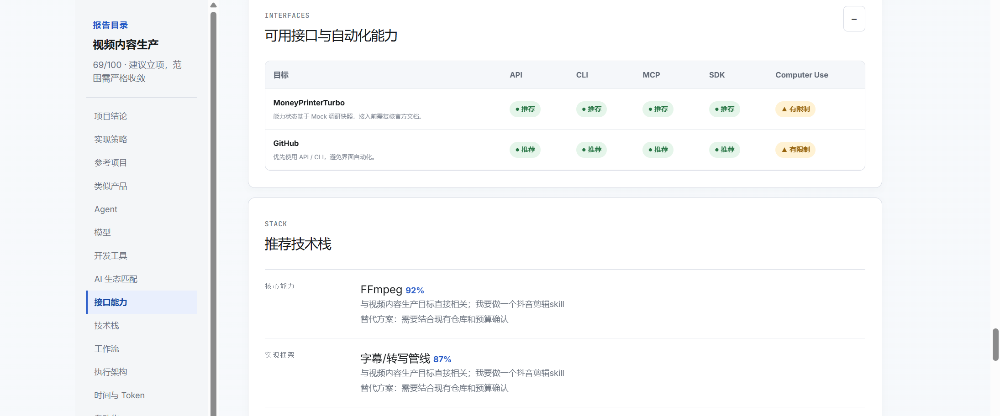

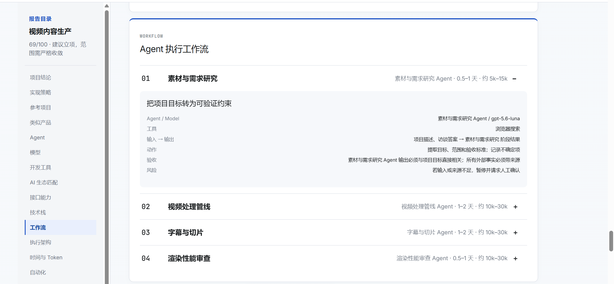

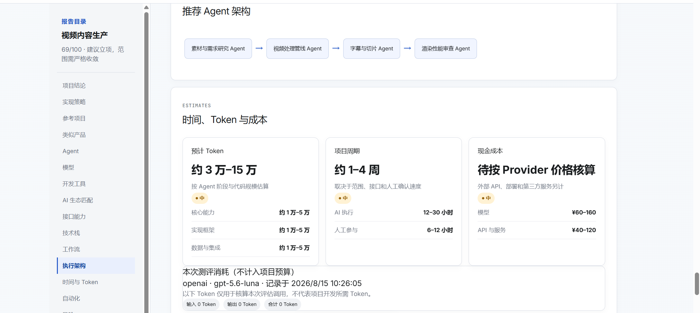

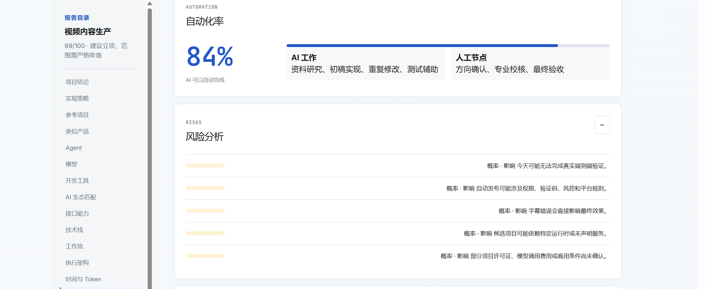

### 9. 项目专属 Prompt 与 AGENTS.md

Prompt Generator 支持 Codex、Claude Code、Cursor 和 OpenCode 模板，并可切换 Master Prompt、单个 Agent Prompt 和 `AGENTS.md`。生成内容来自当前项目的目标、技术栈、核验来源、Agent 顺序、工具、验收标准和风险，而不是固定示例。

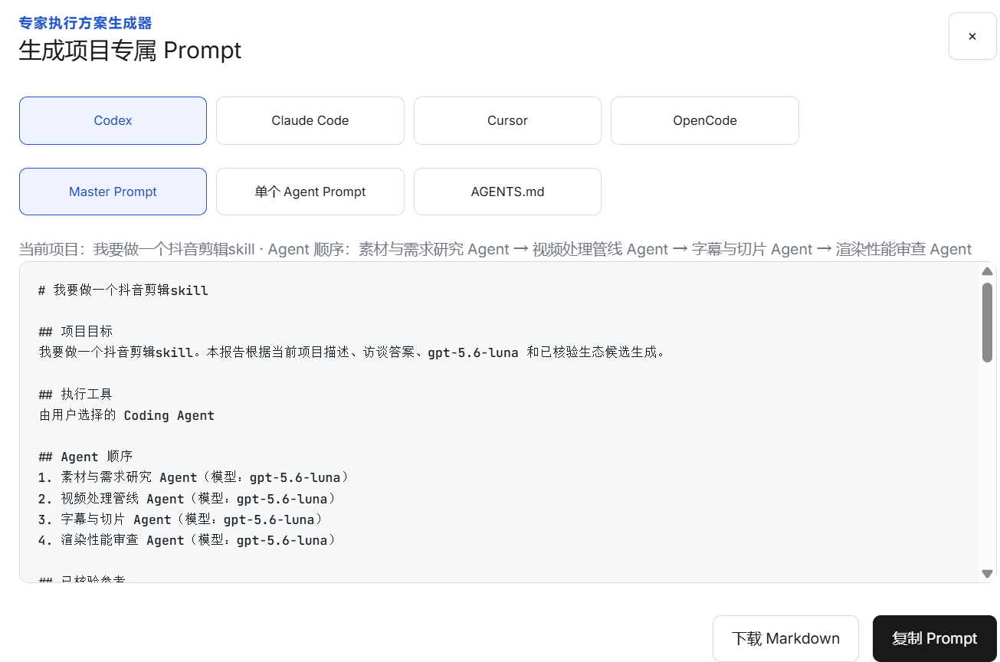

## 一次评估会做什么

```text
项目描述 + 访谈答案 + 已选模型
        ↓
项目画像与需求标签
        ↓
本地知识库检索（模型 / Agent / Skill / MCP / 工具 / GitHub）
        ↓
实时来源补充与链接核验
        ↓
规则过滤、相关性排序与能力匹配
        ↓
项目专属报告、Agent 顺序、Prompt 和 AGENTS.md
```

报告不是固定模板：不同项目会得到不同的策略、参考项目、工具链、Agent 队列、模型路由、风险、时间 / 实施 Token 预测和执行 Prompt。

## 能力概览

- Quick / Expert 双模式评估
- OpenAI / Codex CLI、Anthropic / Claude CLI、Gemini CLI、DeepSeek 和 OpenAI-compatible API 配置
- 项目级模型选择：用户选择的 Provider 和模型会随本次评估绑定并记录在报告中
- 本地 SQLite 知识库，内置模型、Agent、AI 工具、Skill、MCP、Plugin、GitHub 项目、产品和工程实践种子数据
- 知识库优先、实时来源补充：GitHub、官方页面、Registry 结果会标记来源和更新时间
- 本机 Skill / MCP / CLI 扫描与 JSON 导入；敏感路径、Token、Cookie 和 API Key 不写入知识库
- 项目专属 Agent 顺序、模型路由、Workflow、AGENTS.md、Master Prompt 和单 Agent Prompt
- 历史记录、报告导出、模型比较、风险、时间 / 实施 Token / API 成本预测

## 快速开始

```bash
npm install
npm run dev
```

打开 <http://localhost:3000>，在首页描述项目并开始评估。AI 连接配置位于 `/settings/ai`，知识库管理位于 `/settings/knowledge`，历史记录位于 `/history`。

首次访问知识库或启动评估时，应用会自动在本地创建 `.agentscope/knowledge.sqlite`，并写入仓库中随附的公开种子目录。下载项目即可获得基础知识库，不需要额外下载数据库文件。

## AI Provider 与安全边界

- API Key 只提交到服务端，不写入浏览器 `localStorage`，报告不包含 Key 原文。
- CLI 连接只调用本机已安装的 `codex`、`claude` 或 `gemini` 命令，不读取 CLI 内部 OAuth 文件、Cookie 或 Token。
- 没有可用 Provider 时，真实分析会明确失败，不回退成假报告。
- 网页 OAuth 只有配置官方 Client ID / Secret 后才会启用；未配置时返回不可用状态，不伪造登录成功。
- `.env`、`.env.local`、`.agentscope/`、SQLite 运行时文件、日志、导出物和个人历史记录均被 Git 忽略。

复制 `.env.example` 为 `.env.local`，只填写自己需要的服务端配置。`USE_MOCK_DATA=true` 仅用于明确的演示 / 测试模式，不代表真实 Provider 已连接。

## 知识库

公开种子数据位于 `data/knowledgeCatalog.ts`、`data/knowledgeCatalogExpansion.ts` 及相关目录，包含具体模型 ID、能力标签、价格说明、官方链接、GitHub 链接和快照时间。它们会在首次启动时自动初始化到本地 SQLite。

用户自己的上传记录、本机扫描结果和自定义条目保存在本机 `.agentscope/knowledge.sqlite`，不会随代码上传。这样下载者能获得通用公开知识，同时不会拿到原用户的私有配置。

```bash
npm run knowledge:sync
```

可手动同步公开来源；设置页也提供立即同步、本机 Skill / MCP 扫描和 JSON 导入。同步结果会区分已验证、待确认、快照和 AI 推测，不宣称覆盖整个市场。

## 测试与构建

```bash
npm run lint
npm run typecheck
npm run test:reports
npm run test:knowledge
npm run test:knowledge-coverage
npm run test:local-discovery
npm run test:customization
npm run test:prompt
npm run test:discovery
npm run build
```

## 项目结构

```text
app/                    Next.js App Router 页面和 API
components/             访谈、分析、报告和 Prompt UI
data/                   可公开发布的知识库种子与项目数据
services/               Provider、知识库、检索、分析和 Prompt 服务层
ai/                     CLI Adapter 与 Provider Router
scripts/                同步、校验和测试脚本
docs/                   知识库与部署说明
.agentscope/            本地运行时数据库和连接数据（不提交）
```

## 当前边界

这是本地单用户优先的可运行版本。Provider 连接、历史记录和知识库运行时数据默认保存在本机；正式多用户部署前，应接入数据库、账户隔离、服务端加密密钥、CSRF / 防重放和任务队列。外部来源失败时系统会保留最近快照并明确标注时间，不把未经核验的模型输出当成事实。
