# AgentScope（小君AI测评）

AgentScope 当前是 **Evidence-grounded AI Engineering Planner**：输入真实项目后，系统会抽取多领域需求画像，检索知识库与 GitHub，用可解释评分推荐模型 / Agent / 工具 / 开源项目，并标出证据、未知项和下一步施工动作。

它不是“AI 自动给你生成一堆推荐”。Live 报告禁止混入 Demo/Mock 模板；评分数值必须能追溯到需求重叠、仓库元数据或价格来源。证据不足时输出 `unknown` / `needs_confirmation`，而不是填一个看起来很准的数字。

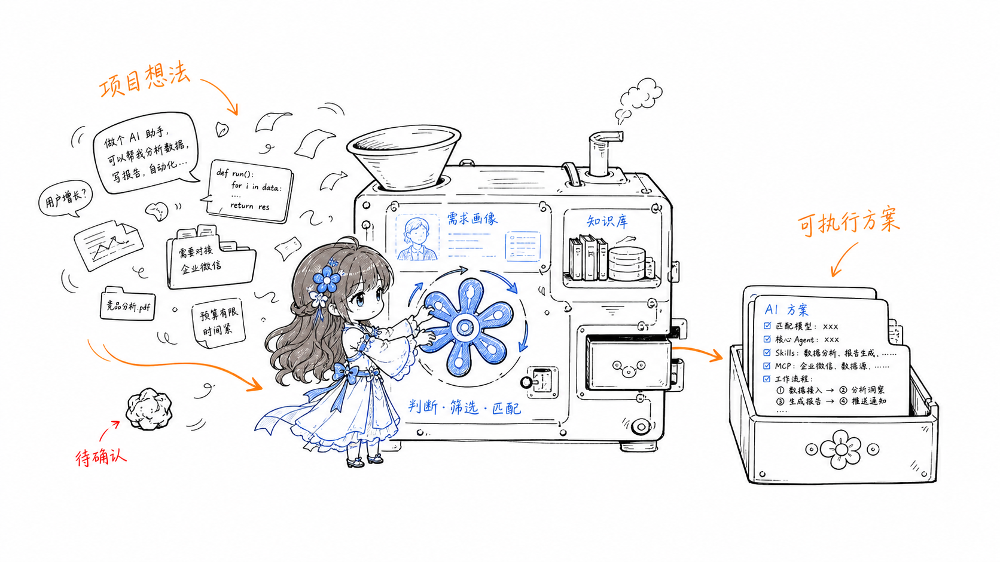

上图展示 AgentScope 的核心工作方式：把项目想法、访谈信息和已有知识交给需求画像与知识库，再经过来源核验、规则筛选和能力匹配，生成项目专属的模型、Agent、Skill、MCP、Workflow、报告与 Prompt。图中的内容用于解释产品流程，不代表固定的模型或工具组合。

## 产品预览

下面的截图来自 AgentScope 的实际界面，按“输入项目 → 配置能力 → 分析 → 生成执行方案”的使用路径展示。截图中的项目内容是演示数据，Provider、模型、成本与外部来源以用户实际配置和最新核验结果为准。

### 1. 项目输入与模型选择

用户先描述目标，再选择 Quick / Expert 模式和本次评估使用的 Provider / 模型。模型选择会绑定到当前项目，不会在分析过程中静默切换。


### 2. AI Provider 与研究能力配置

AI 配置页支持 Codex CLI、Claude CLI、Gemini CLI、DeepSeek 和自定义 OpenAI-compatible Provider；研究能力页可配置浏览器搜索、GitHub、浏览器自动化、MCP、文件访问和终端执行。

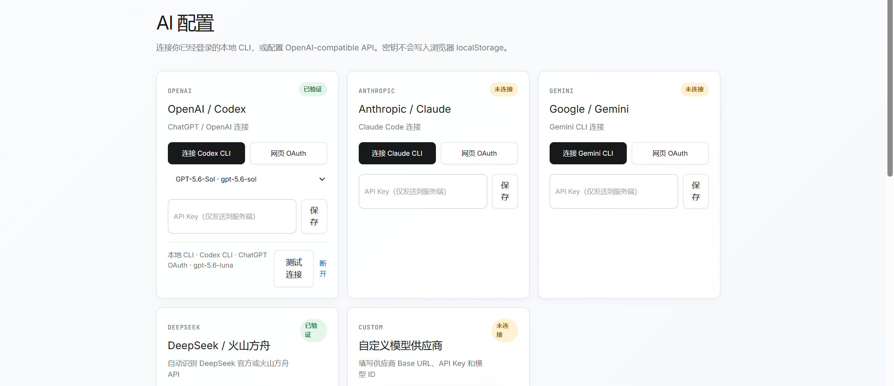

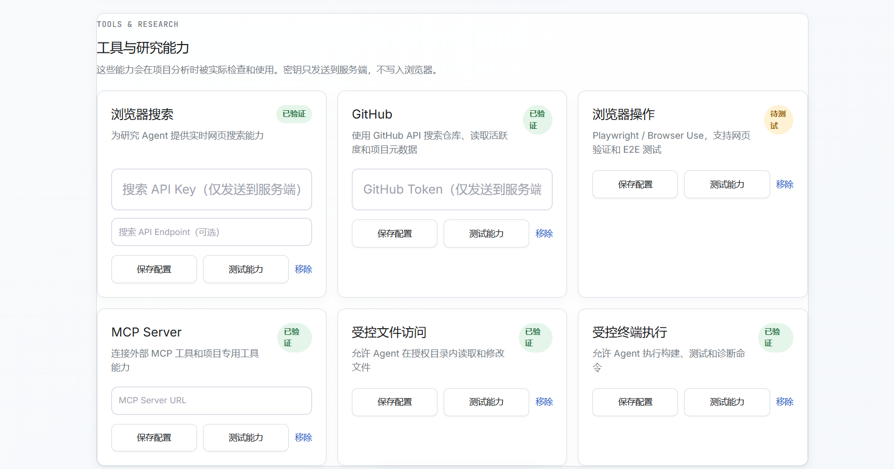

### 3. 知识库与本机能力

知识库用于沉淀模型、Agent、Skill、MCP、Plugin、工具和参考项目。用户可以同步公开来源、扫描本机 Skill / MCP，或导入自己的 JSON；敏感凭据不会被扫描或写入知识库。

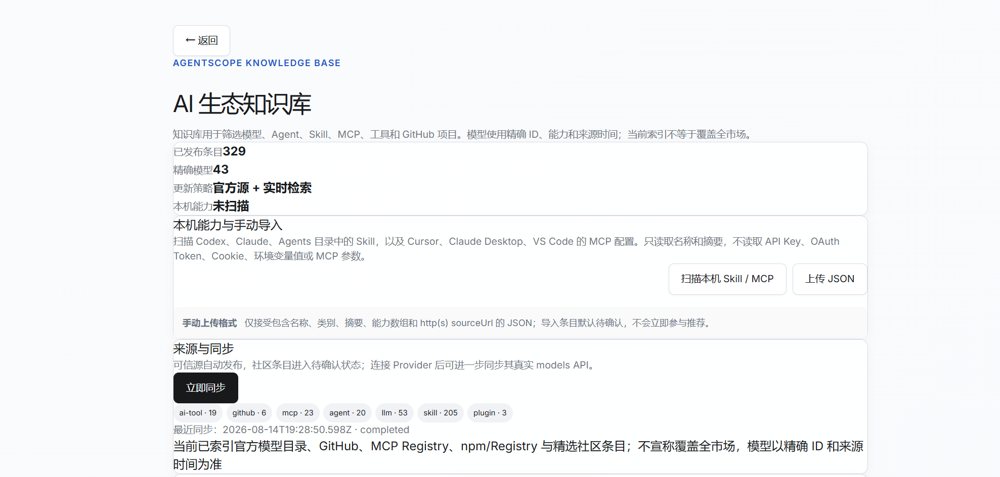

### 4. 历史记录

历史页面保留过去的项目描述、访谈进度、Provider / 模型、分析状态和报告入口。旧报告会标记生成状态，输入或知识库变化后需要重新分析。

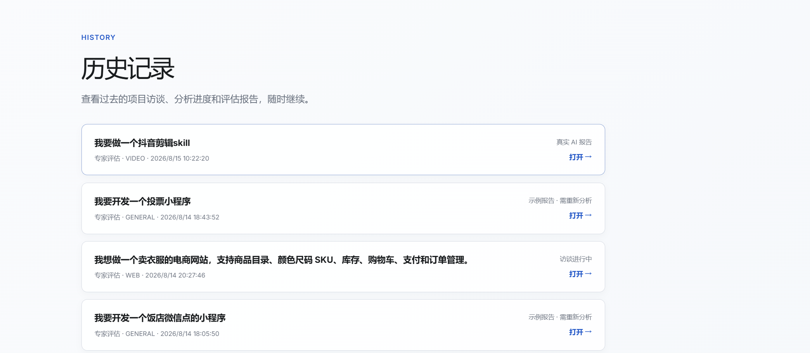

### 5. 项目结论与实施策略

报告首先给出项目专属结论、可行性评分和推荐策略，再展示时间、实施 Token、AI / API 成本与人工投入。这里的 Token 是项目实施预测，不是本次评估调用消耗。

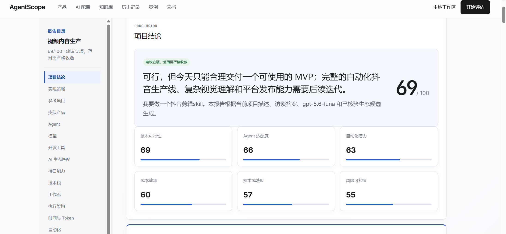

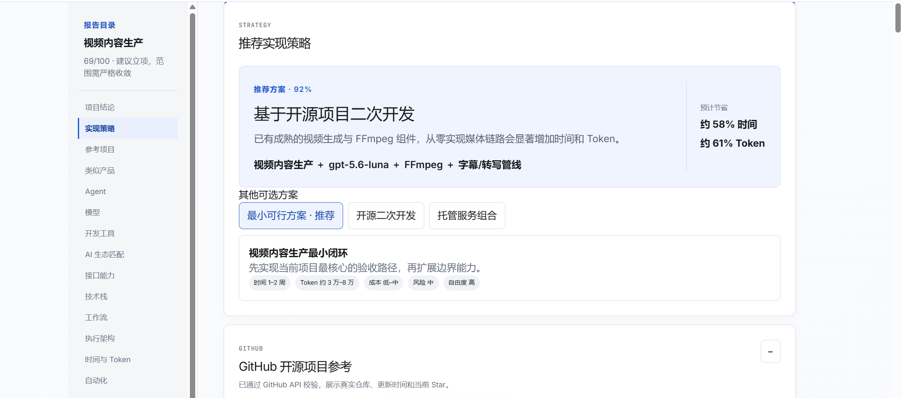

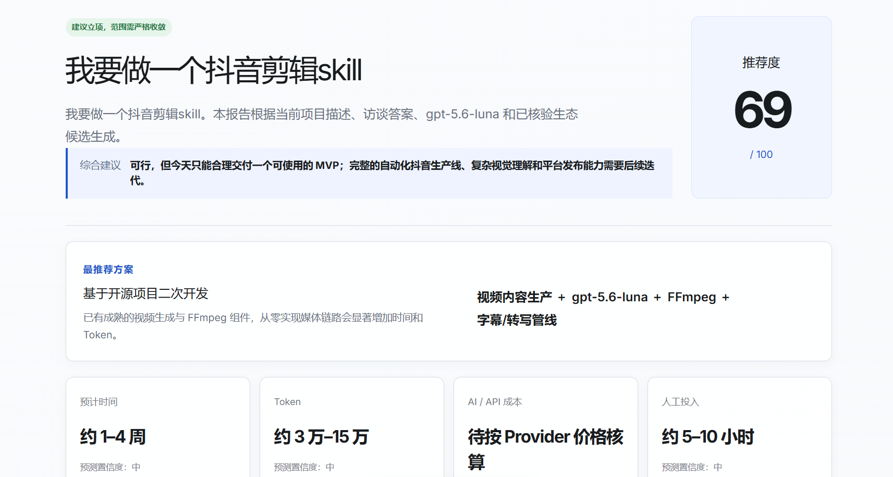

### 6. GitHub 项目与类似产品

系统优先查询本地知识库，再补充 GitHub 和官方来源，并对仓库链接、更新时间、Star、License 等信息进行核验。类似产品用于理解用户流程和边界，不等于建议直接复制产品或代码。

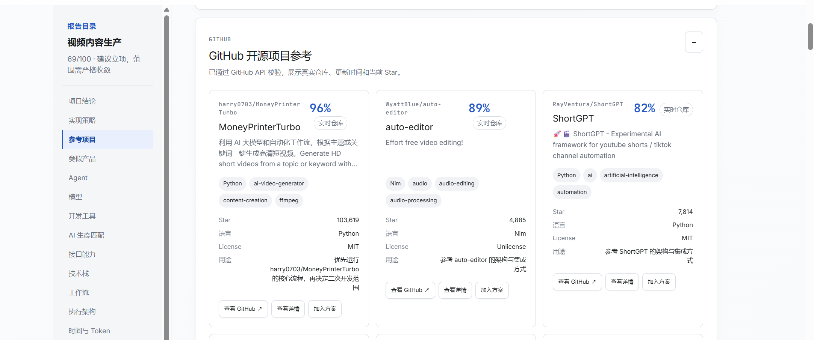

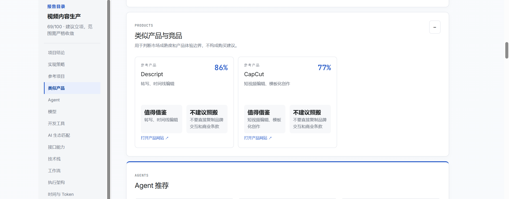

### 7. Agent、模型与开发工具

推荐结果会按当前项目生成 Agent 队列、模型角色路由和工具链，并解释每项能力为什么匹配、哪些条件仍需人工确认。不同项目会得到不同的 Agent 顺序和模型组合。

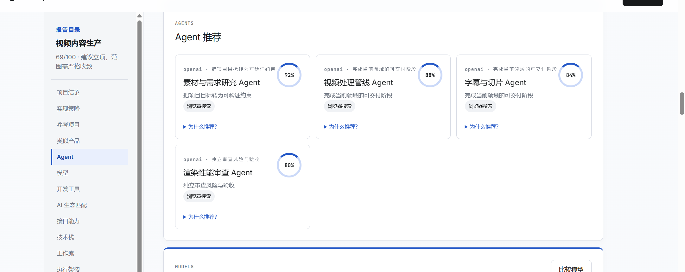

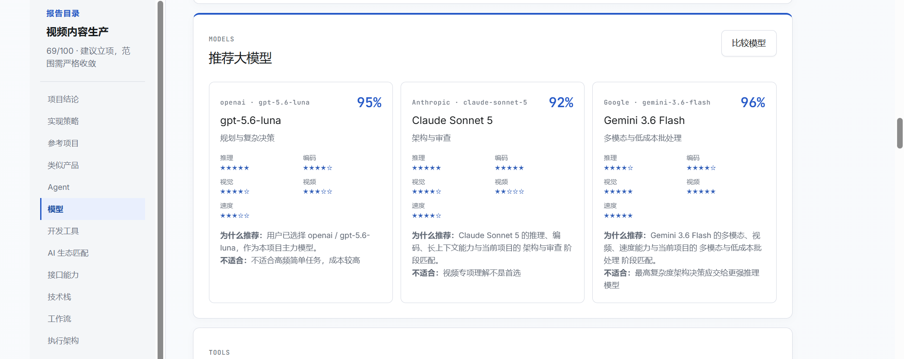

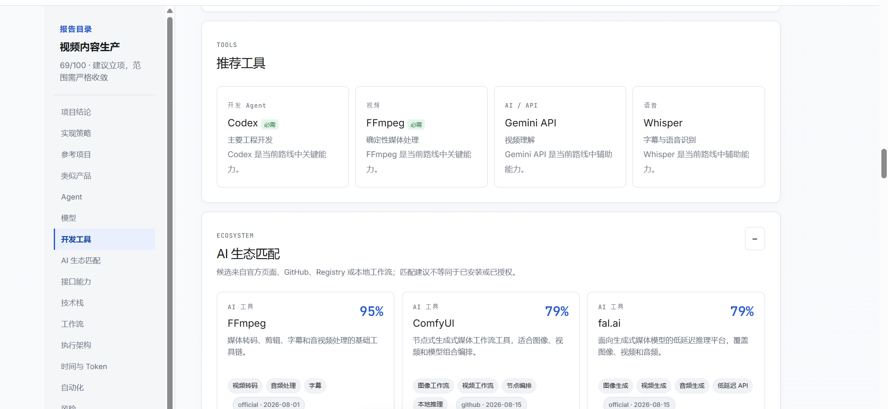

### 8. 能力矩阵、Workflow、估算与风险

报告会把 API、CLI、MCP、SDK、浏览器和 Computer Use 能力放入矩阵，进一步展开 Agent Workflow、架构节点、自动化率、时间 / Token / 成本估算，以及风险和人工确认点。

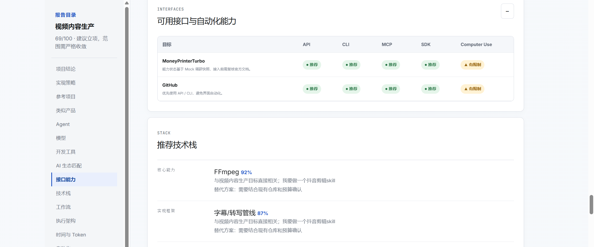

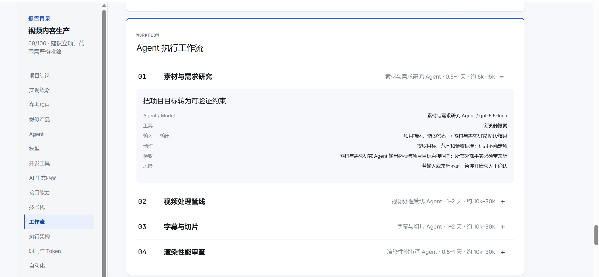

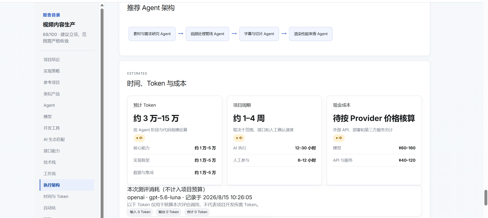

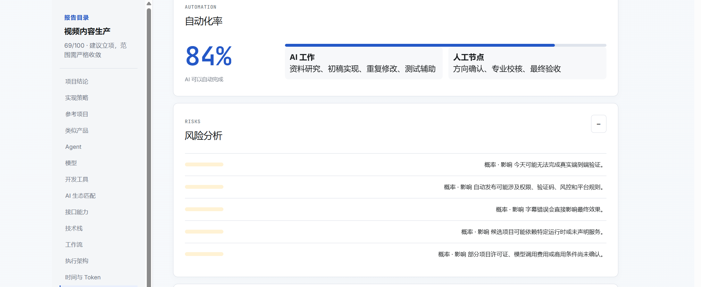

### 9. 项目专属 Prompt 与 AGENTS.md

Prompt Generator 支持 Codex、Claude Code、Cursor 和 OpenCode 模板，并可切换 Master Prompt、单个 Agent Prompt 和 `AGENTS.md`。生成内容来自当前项目的目标、技术栈、核验来源、Agent 顺序、工具、验收标准和风险，而不是固定示例。

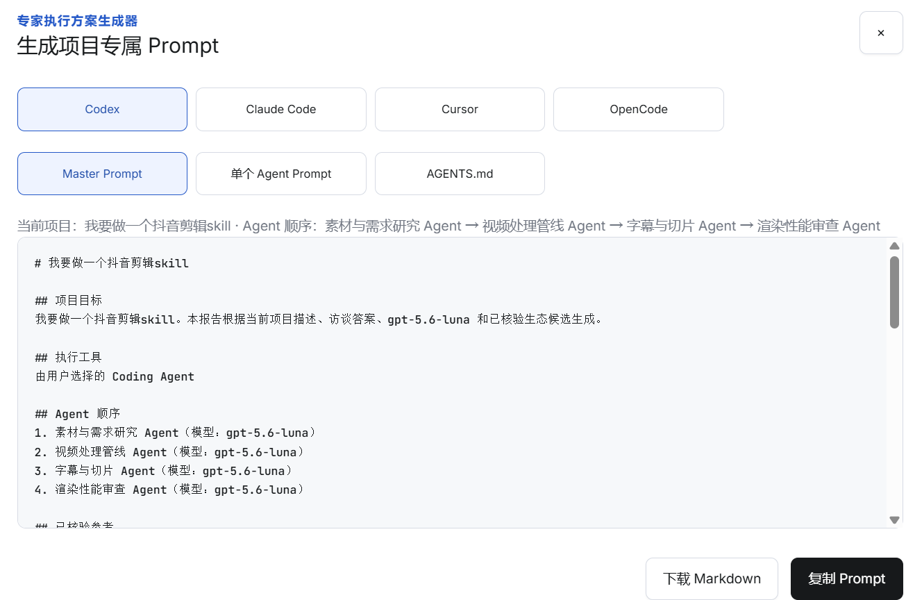

## 一次评估会做什么

```text
项目描述 + 访谈答案 + 已选模型
        ↓
项目画像与需求标签
        ↓
本地知识库检索（模型 / Agent / Skill / MCP / 工具 / GitHub）
        ↓
实时来源补充与链接核验
        ↓
规则过滤、相关性排序与能力匹配
        ↓
项目专属报告、Agent 顺序、Prompt 和 AGENTS.md
```

报告不是固定模板：不同项目会得到不同的策略、参考项目、工具链、Agent 队列、模型路由、风险、时间 / 实施 Token 预测和执行 Prompt。

## How recommendations are calculated

GitHub 相关度不再使用搜索名次或纯 Star，而是加权：

`domain * 0.28 + featureOverlap * 0.24 + stackFit * 0.18 + maturity * 0.12 + maintainability * 0.12 + licenseFit * 0.06`

知识库检索一次统一：

`BM25 Top 40 ∪ Semantic Top 40（全库 cosine / VectorIndex）→ 硬过滤 unpublished/inactive/平台/敏感度 → ruleRerank Top 15`

Hybrid 权重固定为 `lexical 0.35 + semantic 0.40 + metadata 0.15 + source 0.10`。Embedding 不可用时整次 `retrievalMode = lexical`，并对 `lexical/metadata/source` **重归一一次**，所有候选共用；某维缺失填 `null` 按 0 计，不再按候选重归一。BM25 与 cosine 都先 min-max 到 `[0,1]`。

未配置 `EMBEDDING_*` 时默认是 corpus 级 BM25 + 中文 n-gram（`retrievalMode = lexical`）。live 路径走 `retrieveKnowledgeHybridAsync`；HTTP 失败不会静默截断语料，整次回退 lexical。

评估模型（evaluator）和执行模型（executionModels）分开。用户选 Codex 来生成报告，不会自动把它写成“本项目最适合的开发模型”。

## Evidence model

每条关键推荐尽量带 `evidenceIds`。Evidence 类型包括 official / github / knowledge-base / provider / calculation / llm-inference / user-input / benchmark。网页、README、MCP 元数据一律视为 UNTRUSTED DATA，只作为引用，不能改写系统指令。

## Quick vs Expert

- **Quick**：Requirement Analyst → Completeness Gate。Gate 失败时先 `validExecutionPlan: false` 再出报告，不计 Plan Version。成功则检索 → Router → Estimator → 报告。Quick **不跑** LLM Critic。
- **Expert**：Requirement Analyst → Researcher → Architect → Router → Estimator → Rule Critic → optional LLM Critic → Verifier → Final Judge。无独立 critic 模型时 `mode: optional-rule-fallback`，只输出 blockingIssues / warnings / disagreements / suggestedChanges，**不得改** Star、License、Model ID、Pricing。完整度不足不计正式 Plan Version。

Readiness 是工程启发式，不是审计：

- **Prototype Ready**：核心需求明确 + 核心 feature 有 acceptance + 技术路径可行 + 无 prototype blocking。hosting cost unknown **不挡** Prototype。
- **Development Ready**：completeness ≥ 0.7 + architecture 完整 + required features 全映射到 task + 关键栈/外部 API 确认 + 无 development blocking。`needsGithub` 时才要 verified GitHub；本地 STM32 无 GitHub 仍可 development_ready。核心芯片 unknown **挡** Development。
- **Production Ready**：在 development 之上再查 security / observability / deployment / backup / data lifecycle / rate limit / failure recovery / compliance / performance。这是规则启发式，不是生产审计。

## Confidence

报告拆成三种分：**可行性**、**方案质量**、**证据可信度**。不再用一个 83 分同时表示能不能做和有多可信。`unknown` 显示「暂无足够证据」，不显示 0 或 50。估算方法标明 `heuristic-v1`。

## Known limitations

- Anthropic / Gemini 连接可保存，但评估适配器仍是 `partial`，首页不会拿它们当可评估 Provider。
- 没有 Embedding Provider 时检索不是语义搜索。
- Hosting / Database / SaaS 成本经常是 `unknown`，除非知识库有可核验单价。
- 本机仍是单用户优先；历史已写入 SQLite（`projects.sqlite` / `reports.sqlite`），浏览器 localStorage 只作缓存。
- Production Ready 目前是工程启发式（security/observability 等规则），不是生产审计。
- LLM Critic 为 optional；无独立 critic 模型时回退规则，不会修改事实字段。

## Evaluation benchmark

`tests/evaluation-cases/` 目前有 90 条黄金案例（含跨域/模糊需求）。本轮离线真实成绩（知识库 + stub GitHub，不打外网）：Domain F1 ≈ 0.91，Feature Recall ≈ 0.99，Tool P@5 ≈ 0.50，Agent Recall@5 = 1.00，GitHub NDCG@5 = 1.00，Evidence Coverage = 1.00，Hallucination Rate = 0.00，Readiness Accuracy = 1.00。`npm run test:benchmark` 打印：

```text
AgentScope Benchmark
Cases: N
Domain F1: …
Feature Recall: …
Tool P@5: …
Agent Recall@5: …
GitHub NDCG@5: …
Evidence Coverage: …
Hallucination Rate: …
Readiness Accuracy: …
```

回归：Domain F1 / Feature Recall / Evidence Coverage / Readiness Accuracy 掉 > 0.03 则失败。baseline 来自本轮真实跑分，不把 case 数量当成绩。

## 能力概览

- Quick / Expert 双模式评估
- OpenAI / Codex CLI、Anthropic / Claude CLI、Gemini CLI、DeepSeek 和 OpenAI-compatible API 配置
- 项目级模型选择：用户选择的 Provider 和模型会随本次评估绑定并记录在报告中
- 本地 SQLite 知识库，内置模型、Agent、AI 工具、Skill、MCP、Plugin、GitHub 项目、产品和工程实践种子数据
- 知识库优先、实时来源补充：GitHub、官方页面、Registry 结果会标记来源和更新时间
- 本机 Skill / MCP / CLI 扫描与 JSON 导入；敏感路径、Token、Cookie 和 API Key 不写入知识库
- 项目专属 Agent 顺序、模型路由、Workflow、AGENTS.md、Master Prompt 和单 Agent Prompt
- 历史记录、报告导出、模型比较、风险、时间 / 实施 Token / API 成本预测

## 给别人的 5 分钟上手

```bash
git clone https://github.com/Joho6666/xiaojunceping.git
cd xiaojunceping
cp .env.example .env.local
npm install
npm run dev
```

打开 http://localhost:3000 → `/settings/ai` 连接 **Codex CLI** 或 **DeepSeek / OpenAI-compatible API**。没有可评估模型时首页不能开始，系统也不会用示例报告顶上。

试跑：`STM32 温控器，使用 Keil，读取 DS18B20，OLED 显示`。应看到 embedded/firmware，不应默认出现 Web 或 Shopify。

可选：`GITHUB_TOKEN` 提高仓库核验；`EMBEDDING_BASE_URL` + `EMBEDDING_API_KEY` + `EMBEDDING_MODEL` 才会启用 hybrid 检索。

## 快速开始

```bash
npm install
npm run dev
```

打开 <http://localhost:3000>，在首页描述项目并开始评估。AI 连接配置位于 `/settings/ai`，知识库管理位于 `/settings/knowledge`，历史记录位于 `/history`。

首次访问知识库或启动评估时，应用会自动在本地创建 `.agentscope/knowledge.sqlite`，并写入仓库中随附的公开种子目录。下载项目即可获得基础知识库，不需要额外下载数据库文件。

## AI Provider 与安全边界

- API Key 只提交到服务端，不写入浏览器 `localStorage`，报告不包含 Key 原文。
- CLI 连接只调用本机已安装的 `codex`、`claude` 或 `gemini` 命令，不读取 CLI 内部 OAuth 文件、Cookie 或 Token。
- 没有可用 Provider 时，真实分析会明确失败，不回退成假报告。
- 网页 OAuth 当前未启用，请用本地 CLI 或 API Key。
- `.env`、`.env.local`、`.agentscope/`、SQLite 运行时文件、日志、导出物和个人历史记录均被 Git 忽略。

复制 `.env.example` 为 `.env.local`。未设置 `DATABASE_ENCRYPTION_KEY` 时，连接会以本机受限权限文件保存（`.agentscope/*.json`），重启后仍可用；设置密钥后改为 AES-256-GCM。

## 知识库

公开种子数据位于 `data/knowledgeCatalog.ts`、`data/knowledgeCatalogExpansion.ts` 及相关目录，包含具体模型 ID、能力标签、价格说明、官方链接、GitHub 链接和快照时间。它们会在首次启动时自动初始化到本地 SQLite。

用户自己的上传记录、本机扫描结果和自定义条目保存在本机 `.agentscope/knowledge.sqlite`，不会随代码上传。这样下载者能获得通用公开知识，同时不会拿到原用户的私有配置。

```bash
npm run knowledge:sync
```

可手动同步公开来源；设置页也提供立即同步、本机 Skill / MCP 扫描和 JSON 导入。同步结果会区分已验证、待确认、快照和 AI 推测，不宣称覆盖整个市场。

## 测试与构建

```bash
npm run lint
npm run typecheck
npm test
npm run build
```

`npm test` 覆盖：reports、knowledge、knowledge-coverage、local-discovery、customization、prompt、discovery、cli、report-store、golden、live-integrity、requirements、retrieval（含 Case E 第 200 条语义）、ranking、verification、readiness（Case B/C/D）、traceability、benchmark、history、evidence-integrity（Case A）、hybrid-scoring、embedding-cache、unknown-classification、plan-version（Case G）、task-dag（Case F）、model-verification、expert-pipeline、benchmark-regression。

## 项目结构

```text
app/                    Next.js App Router 页面和 API
components/             访谈、分析、报告和 Prompt UI
data/                   可公开发布的知识库种子与项目数据
services/               Provider、知识库、检索、推荐、评估流水线和 Prompt 服务层
tests/evaluation-cases/ 黄金评测案例
ai/                     CLI Adapter 与 Provider Router
scripts/                同步、校验和测试脚本
docs/                   知识库与部署说明
.agentscope/            本地运行时数据库和连接数据（不提交）
```

## 当前边界

这是本地单用户优先的可运行版本。Provider 连接、历史记录和知识库运行时数据默认保存在本机；正式多用户部署前，应接入数据库、账户隔离、服务端加密密钥、CSRF / 防重放和任务队列。外部来源失败时系统会保留最近快照并明确标注时间，不把未经核验的模型输出当成事实。
